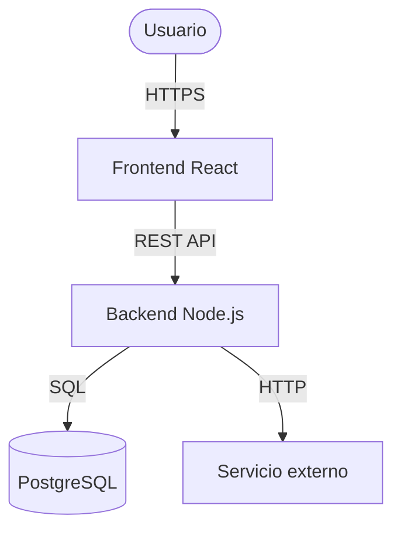
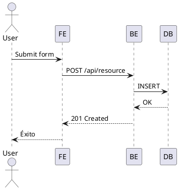

# Estándares de Documentación — Referencia Completa

## 1. Herramientas y cuándo usar cada una

| Herramienta | Mejor para | Cuándo NO usarla |
|------------|-----------|-----------------|
| **Markdown en repo** | Docs técnicas, ADRs, README, CONTRIBUTING | Docs que usuarios finales necesitan navegar con UI amigable |
| **Docusaurus / VitePress** | Sitio de documentación público con buscador | Equipos pequeños sin tiempo para mantener otro sistema |
| **Notion** | Docs de proceso, onboarding, playbooks del equipo | Documentación técnica versionada (no tiene historial de git) |
| **Confluence** | Equipos enterprise con Jira | Proyectos open source o sin presupuesto |
| **Storybook** | Documentación de componentes FE con ejemplos vivos | Backends, APIs, docs funcionales |
| **OpenAPI / Swagger** | APIs REST con endpoints formales | APIs internas simples sin consumidores externos |

---

## 2. Diagramas de arquitectura

### Recomendación: C4 Model

El C4 Model define 4 niveles de zoom. Usar el nivel adecuado al contexto:

- **Nivel 1 — Context:** El sistema como caja negra, sus usuarios y sistemas externos. Para stakeholders.
- **Nivel 2 — Container:** Las partes principales del sistema (app web, API, BD, jobs). Para el equipo técnico.
- **Nivel 3 — Component:** Los módulos internos de un container específico. Para developers de ese container.
- **Nivel 4 — Code:** Clases/funciones. Raramente necesario; el código es su propia documentación.

### Mermaid (recomendado en repos GitHub)



Mermaid renderiza directamente en GitHub, GitLab y Notion. Preferirlo sobre draw.io para diagramas que viven en el repositorio.

### PlantUML (para diagramas de secuencia complejos)



---

## 3. Documentación de APIs con OpenAPI

### Estructura mínima de un endpoint documentado

```yaml
/users/{id}:
  get:
    summary: Obtener usuario por ID
    parameters:
      - name: id
        in: path
        required: true
        schema:
          type: string
          format: uuid
    responses:
      200:
        description: Usuario encontrado
        content:
          application/json:
            schema:
              $ref: '#/components/schemas/User'
      404:
        description: Usuario no encontrado
      401:
        description: No autenticado
```

### Convención de documentación de APIs con el backend-developer

1. El Backend Developer genera el esquema OpenAPI como parte del desarrollo (no como tarea separada).
2. El Documentation Expert revisa que todos los endpoints tengan: summary, descripción de parámetros, todos los códigos de respuesta posibles, ejemplos.
3. El esquema vive en `/docs/api/openapi.yaml` y se versiona junto al código.
4. Si hay breaking changes en la API, el ADR correspondiente debe existir antes del merge.

---

## 4. Proceso de auditoría de documentación

### Frecuencia recomendada: cada 2 sprints

#### Checklist de auditoría

```
README
[ ] Setup local funciona paso a paso (testear en máquina nueva o VM)
[ ] Variables de entorno documentadas y coinciden con .env.example actual
[ ] Versiones de dependencias actualizadas
[ ] Links internos funcionan (sin 404)

ADRs
[ ] Decisiones técnicas significativas del último mes tienen ADR
[ ] ADRs obsoletos marcados como "Obsoleto" o "Reemplazado por ADR-NNN"

APIs
[ ] Todos los endpoints nuevos tienen documentación OpenAPI
[ ] Ejemplos de request/response son válidos con la versión actual

Onboarding
[ ] Un nuevo Developer puede seguirla sin preguntas ad-hoc
[ ] Accesos y herramientas listadas son los actuales

Changelog
[ ] Todas las releases tienen entrada en CHANGELOG.md
[ ] Release Notes en GitHub generadas y publicadas
```

#### Cómo registrar deuda de documentación

Crear un issue en GitHub con label `docs-debt`:

```markdown
**Tipo:** [README / ADR / API / Onboarding / Manual]
**Descripción:** Qué está desactualizado o faltante
**Impacto:** Quién se ve afectado si no se corrige
**Esfuerzo estimado:** [XS / S / M / L]
**Prioridad:** [Alta / Media / Baja]
```

---

## 5. Plantilla de Runbook

Los runbooks documentan procedimientos operativos. Deben ser seguibles por alguien que nunca lo ejecutó antes.

```markdown
# Runbook: [Nombre del procedimiento]

**Última actualización:** YYYY-MM-DD
**Propietario:** documentation-expert + devops-engineer
**Tiempo estimado:** X minutos
**Impacto si falla:** [descripción del riesgo]

## Cuándo usar este runbook
Descripción de la situación que activa este procedimiento.

## Prerequisitos
- [ ] Acceso SSH al servidor
- [ ] Variable ENV_VAR configurada
- [ ] [Otro requisito]

## Pasos

### 1. [Nombre del paso]
```bash
comando exacto a ejecutar
```
**Resultado esperado:** descripción de qué debe ver si salió bien.
**Si falla:** qué hacer.

### 2. [Nombre del paso]
...

## Verificación final
```bash
comando para confirmar que todo está bien
```

## Rollback
Si algo salió mal, ejecutar en orden inverso:
```bash
comando de rollback
```

## Contactos de escalación
| Situación | Contactar a |
|-----------|------------|
| Falla en BD | database-specialist |
| Falla en servidor | devops-engineer |
```

---

## 6. Guía de escritura técnica

### Principios base

**Escribir para el lector correcto.** Un ADR no es un manual de usuario. Antes de escribir, definir: ¿quién lee esto y qué necesita poder hacer después de leerlo?

**Documentar el "por qué" más que el "qué".** El código ya dice qué hace. Lo valioso es por qué se tomó una decisión, qué alternativas se descartaron y qué trade-offs se aceptaron.

**Documentación cercana al código = mayor longevidad.** Documentación en el repo se actualiza con el código. Documentación en herramientas externas se desactualiza silenciosamente.

### Convenciones de escritura

- Usar voz activa: "El sistema envía una notificación" en vez de "Una notificación es enviada por el sistema".
- Párrafos cortos: máximo 3-4 oraciones. Si se alarga, dividir o usar lista.
- Listas para pasos secuenciales; prosa para explicaciones de contexto.
- Código en bloques de código siempre — nunca inline para comandos completos.
- Fechas en formato ISO 8601: `YYYY-MM-DD`.
- Evitar jerga interna sin definir: si el equipo acuñó un término, añadirlo al glosario.

### Convenciones de Markdown

```markdown
# H1 — Solo para el título del documento (uno por archivo)
## H2 — Secciones principales
### H3 — Subsecciones
#### H4 — Usar con moderación

**Negrita** — términos importantes, advertencias
*Cursiva* — énfasis suave, títulos de obras
`código inline` — comandos cortos, nombres de variables, rutas

> Blockquote — notas importantes, advertencias de contexto
```

---

## 7. KPIs de efectividad

| Indicador | Cómo medirlo | Señal positiva |
|-----------|-------------|----------------|
| **Tiempo de onboarding** | Encuesta al nuevo Developer al final del Sprint 1 | Autónomo sin ayuda constante |
| **Docs desactualizadas** | Issues con label `docs-debt` abiertos | Decrece sprint a sprint |
| **US cerradas sin docs requeridas** | Revisión en Sprint Review | Cero |
| **ADRs por decisión significativa** | Ratio decisiones técnicas / ADRs creados | 1:1 |
| **Preguntas respondidas por docs** | Preguntas en canal del equipo vs hits en docs | Ratio docs/preguntas crece |
| **Links rotos en documentación** | Audit con herramienta (markdown-link-check) | Cero en auditoría |

### Herramienta para detectar links rotos

```bash
# Instalar
npm install -g markdown-link-check

# Revisar todos los .md del repo
find . -name "*.md" | xargs -I {} markdown-link-check {}
```

---

## 8. Convención de versionado de la documentación

La documentación vive en el mismo repositorio que el código y se versiona junto a él. Esto garantiza que la rama `main` siempre tenga docs consistentes con el código en `main`.

### En los commits

Usar Conventional Commits para cambios de documentación:

```
docs: actualizar README con instrucciones de setup para Windows
docs: agregar ADR-007 sobre elección de ORM
docs: marcar ADR-003 como obsoleto
docs(api): documentar endpoint POST /payments
docs(onboarding): agregar sección de accesos a staging
```

### En las Pull Requests

Los PRs que modifican comportamiento del sistema deben incluir actualización de docs como parte del PR, no en un PR separado posterior. El Documentation Expert lo verifica en la revisión.
